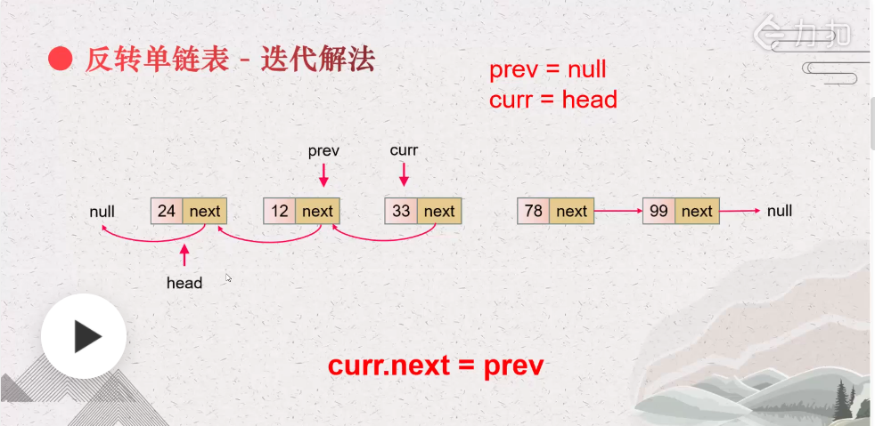

# 反转链表

*easy*

反转一个单链表。

示例:

输入: 1->2->3->4->5->NULL
输出: 5->4->3->2->1->NULL
进阶:
你可以迭代或递归地反转链表。你能否用两种方法解决这道题？

## 方法一：迭代法
 
``` java
/**
 * Definition for singly-linked list.
 * public class ListNode {
 *     int val;
 *     ListNode next;
 *     ListNode() {}
 *     ListNode(int val) { this.val = val; }
 *     ListNode(int val, ListNode next) { this.val = val; this.next = next; }
 * }
 */
class Solution {
    public ListNode reverseList(ListNode head) {
        ListNode prev = null;
        ListNode curr = head;
        while(curr != null){
            //temp存储当前链表
            ListNode temp = curr.next;
            //指针指向互换
            curr.next = prev;
            //下一个循环
            prev = curr;
            curr = temp;
        }
       return prev;
    }
}
```
